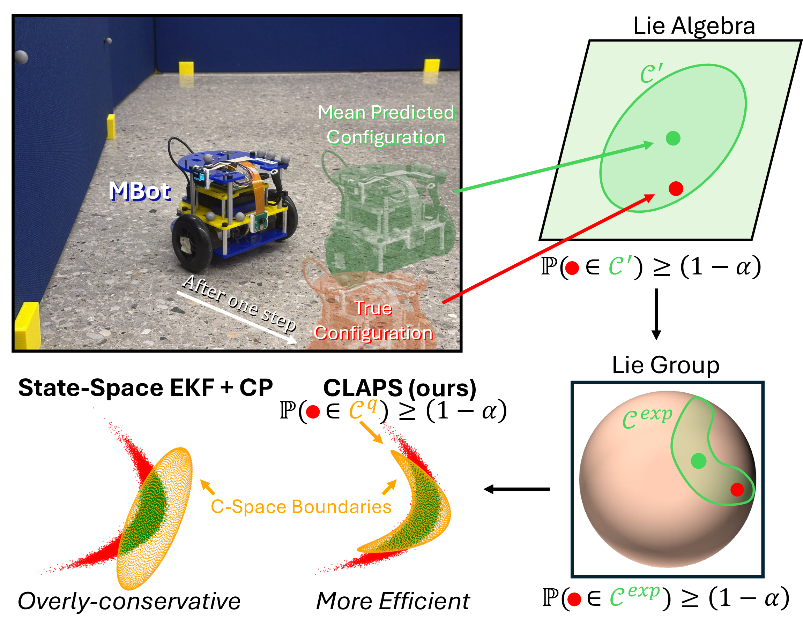

# CLAPS Codebase

<table>
<tr>
<td width="40%">

This repository contains the code implementation of **C**onformal **L**ie-Group **A**ction **P**rediction **S**ets (**CLAPS**), a symmetry-aware conformal prediction-based algorithm that constructs, for a given action, a set guaranteed to contain the resulting system configuration at a user-defined probability.
For more details see the [Project Website](https://um-arm-lab.github.io/claps).

For questions or feedback please email `lmarques@umich.edu`.

</td>
<td width="60%">



</td>
</tr>
</table>

## Setup

To install this codebase do
```bash
git clone --recurse-submodules https://github.com/UM-ARM-LAB/claps_code
cd claps_code
```
and to get the python dependencies (in a `venv` environment)
```bash
./install_venv.sh
source venv/bin/activate
``` 
This sufficient to replicate the results and plots in the paper.

If you want to recollect the raw data in simulation, install [NVIDIA Isaac Sim (Full 4.5.0)](https://docs.isaacsim.omniverse.nvidia.com/4.5.0/installation/index.html) and [NVIDIA Isaac Lab (tested at commit 9be0de5f6196374fa793dc33978434542e7a40d3)](https://github.com/isaac-sim/IsaacLab/tree/9be0de5f6196374fa793dc33978434542e7a40d3). Then, setup a conda environment and run `scripts/full_run.py` with the `--get-calibration-data` and `--get-validation-data` flags.

To recollect the MBot raw data (hardware), refer to [mbot_experiments](https://github.com/UM-ARM-Lab/mbot_experiments/tree/ral25_luis).

## Usage

To replicate the simulation (JetBot) results, run
```bash
./run_all.sh Isaac_Jetbot over_confident 5000 parallel paper-plots
```

## Citing

If you find this repository or our work useful, please consider citing:
```
@misc{marques2025liestrustquantifyingaction,
      title={Lies We Can Trust: Quantifying Action Uncertainty with Inaccurate Stochastic Dynamics through Conformalized Nonholonomic Lie Groups}, 
      author={Luís Marques and Maani Ghaffari and Dmitry Berenson},
      year={2025},
      eprint={2512.10294},
      archivePrefix={arXiv},
      primaryClass={cs.RO},
      url={https://arxiv.org/abs/2512.10294}, 
}
```

## Related Repositories 

This repository installs the following custom Python packages:
- [luis_utils](https://github.com/luis-marques/luis_utils/tree/claps_public): sampling, plotting, conformal prediction, etc.
- [pymatlie](https://github.com/luis-marques/pymatlie/tree/claps): batched implementation of SE(2) dynamics (among other Groups).
- [mbot_experiments](https://github.com/UM-ARM-Lab/mbot_experiments/tree/ral25_luis): for running the MBot experiment and collecting transition data.

Check the respective packages for more extensive and up-to-date functionality. If you find them useful for your work, consider starring and citing.

